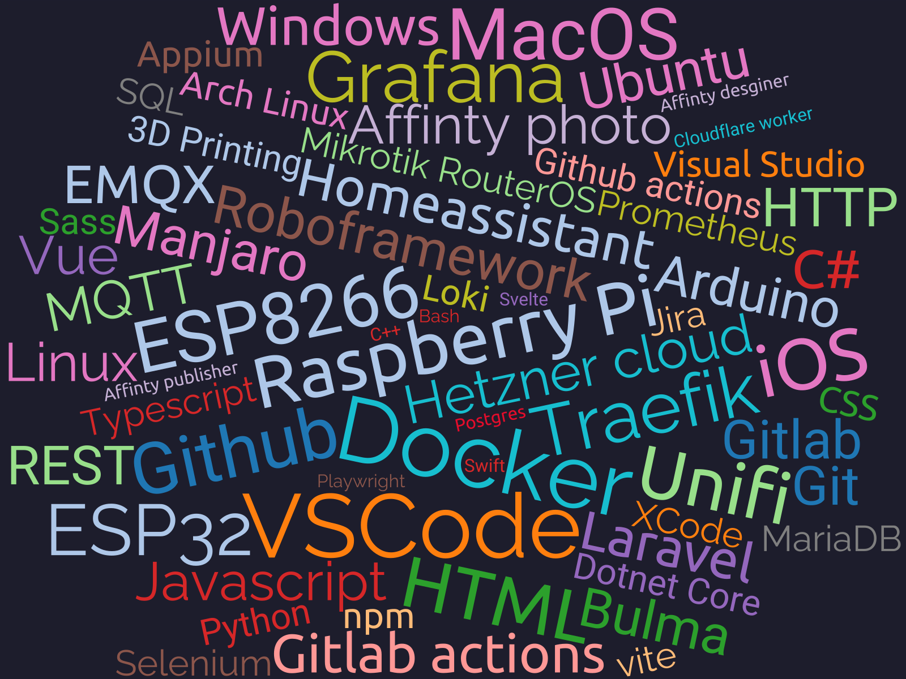

<!-- Banner -->

  

  

## 👨‍💻 About Me

Hi, I'm Lucas!  
I'm a developer and software tester from Germany. I'm passionate about coding, photography, and always eager to learn new things.  
Currently, I'm diving deeper into Laravel and looking forward to exploring Swift, SwiftUI, and UI/UX design in the future.

---

## 🚀 My Skills

---

## 🏆 GitHub Trophies

  

---

  

